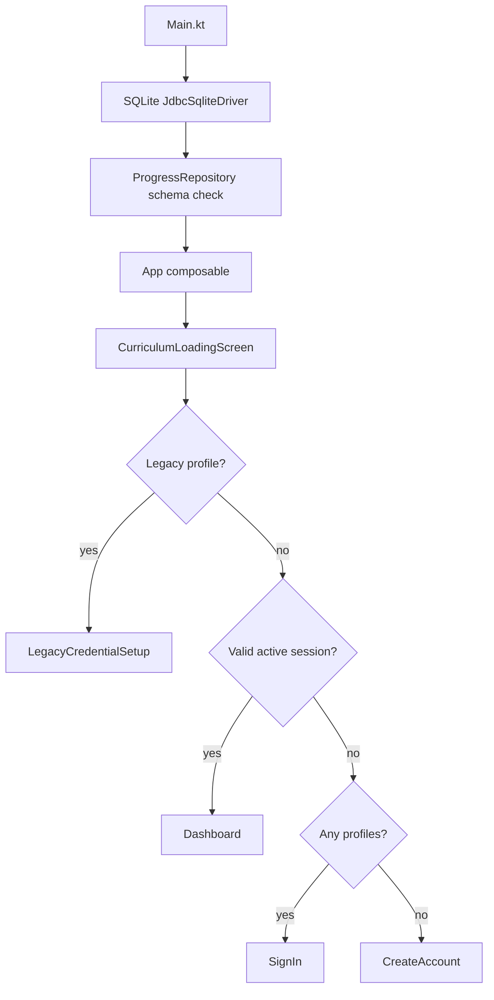
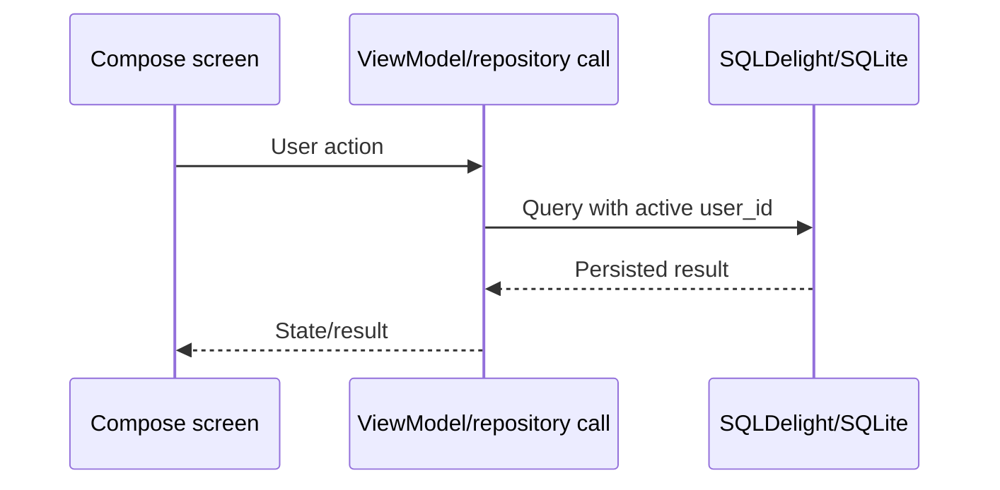

# CodeQuest Academy — Complete Codebase Guide

This document is the hand-off guide for a new engineer or coding agent. It explains where the code lives, how the application starts, how data moves through the system, how authentication works, how curriculum content is loaded, and how to build and verify the Windows desktop application.

## 1. Product and technical summary

CodeQuest Academy is a Kotlin Multiplatform project whose shipped target is a Compose Multiplatform/JVM desktop application for Windows. The product teaches coding through five learning tracks, ten paths, fifty levels, and a node-based progression graph.

The shared module contains almost all application behavior:

- Compose UI and navigation
- SQLDelight schema access
- curriculum parsing and seeding
- progress, projects, activity, settings, and assessment persistence
- local account creation and authentication
- view models for learning workflows

The `desktopApp` module is a thin JVM shell. It creates the desktop window, selects the filesystem database, loads packaged curriculum resources, and calls the shared `App` composable.

Authentication is deliberately offline. There is no Google provider, OAuth flow, browser callback, cloud account, or synchronization service. Local accounts and learning progress stay on the current device.

## 2. Top-level directory map

| Folder/file | Purpose | Safe for an agent to edit? |
|---|---|---|
| `.agents/` | Local agent/task metadata. | Only when a task explicitly concerns agent metadata. |
| `.git/` | Git metadata. This workspace may not contain a normal commit history. | Do not rewrite or reset. |
| `.gradle/` | Gradle caches and daemon state. | Never edit manually. |
| `.jdk/` | Bundled JDK 17 used for deterministic builds. | Do not replace. |
| `build/` | Root-level generated Gradle output. | Generated; do not hand-edit. |
| `curriculum_package/` | Canonical unpacked curriculum package used by tests and curriculum validation. | Edit only when changing curriculum content. |
| `curriculum_unzipped/` | Extracted/inspection copy of the curriculum package. | Generated/reference copy; normally do not edit. |
| `desktopApp/` | Windows/JVM desktop application module. | Yes, for desktop bootstrap, packaging, and desktop resources. |
| `downloads/` | Release ZIPs and downloadable artifacts. | Generated by the release script. |
| `gradle/` | Gradle wrapper support files. | Do not modify unless changing wrapper configuration. |
| `gradle-8.7/` | Bundled Gradle 8.7 executable used in this environment. | Do not modify. |
| `screenshots/` | Manual visual QA screenshots. | Add QA captures when needed; do not treat as source. |
| `scripts/` | Build/release automation. | Yes, when release behavior changes. |
| `shared/` | Shared Kotlin Multiplatform application code. | Main implementation area. |
| `README.md` | Short project and usage overview. | Keep synchronized with behavior. |
| `CODEBASE_GUIDE.md` | This detailed hand-off document. | Update when architecture changes. |
| `LOCAL_ACCOUNT_ARCHITECTURE.md` | Authentication/storage design notes. | Update with auth changes. |
| `DATABASE_MIGRATION_REPORT.md` | Non-destructive database migration notes. | Update with schema changes. |
| `AUTHENTICATION_VALIDATION_REPORT.md` | Auth test/validation summary. | Update when auth tests change. |
| `DESKTOP_BUILD_AND_RELEASE.md` | Build, packaging, artifact, and installer notes. | Update after releases. |
| `curriculum_build_manifest.json` | Curriculum package version/count manifest. | Update only when rebuilding curriculum. |
| `downloads.json` | Website download metadata, generated by release script. | Do not hand-edit except for emergency correction. |
| `index.html`, `styles.css`, `script.js` | Static download/project landing page. | Edit only for website changes. |
| `codequest_progress.db` | A development database created in the workspace by an older/portable launch. | Local data; do not commit or use as test fixture. |

The `build/`, `.gradle/`, `downloads/`, and packaged application directories are outputs. If a generated file appears stale, rebuild it instead of editing it directly.

## 3. Gradle modules and source sets

### `shared`

`shared` is a Kotlin Multiplatform library. Its important source sets are:

- `src/commonMain`: platform-independent models, repository, SQLDelight declarations, Compose UI, navigation, and view models.
- `src/commonTest`: tests that can run on every supported target. At present it contains model-level tests.
- `src/jvmMain`: JVM implementations of `expect` APIs and JVM-only utilities such as password hashing and code execution.
- `src/jvmTest`: SQLite-backed JVM integration tests for accounts, progress, migrations, and curriculum behavior.
- `src/commonMain/composeResources`: packaged curriculum files/resources available to Compose resource processing.
- `src/commonMain/sqldelight`: SQLDelight schema and named queries.

### `desktopApp`

`desktopApp` is a Kotlin/JVM Compose application. It has:

- `src/jvmMain/kotlin/.../Main.kt`: application entry point and database location.
- `src/jvmMain/kotlin/.../JvmCurriculumFileReader.kt`: classpath resource reader for curriculum JSON.
- `src/jvmMain/resources/curriculum`: curriculum files copied into the packaged desktop application.
- `src/jvmMain/resources/branding`: CodeQuest Academy PNG/ICO branding; the ICO is configured as the Windows distributable icon in `desktopApp/build.gradle.kts`.
- `src/jvmTest`: desktop-specific tests, currently empty/no-source in the normal build.

## 4. Application startup and lifecycle

The startup path is:

1. `desktopApp/.../Main.kt` enters Compose `application {}`.
2. `JvmCurriculumFileReader` is remembered once.
3. `localDatabaseFile()` chooses the persistent database:
   - preferred: `%USERPROFILE%\\.codequest-academy\\codequest_progress.db`
   - compatibility fallback: `codequest_progress.db` in the process directory, but only when the new user-profile database does not yet exist.
4. The parent directory is created, then `JdbcSqliteDriver` opens SQLite.
5. `AppDatabase.Schema.create(driver)` is attempted. Existing databases are allowed to continue; SQLDelight/SQLite errors are logged as a safe diagnostic.
6. `ProgressRepository` is constructed. Its initializer runs `ensureSupplementalSchema()` to add missing legacy columns/tables and record migration version 2.
7. `App(fileReader, repository)` creates the shared Compose tree.
8. `App` creates `Navigation` and the rail state `AppViewModel`.
9. The initial route is `Screen.CurriculumLoading`.
10. `CurriculumLoadingScreen` reads the curriculum manifest, validates/seeds the catalog, checks the active session, and routes to the correct screen.

Startup routing rules:

| Condition | Destination |
|---|---|
| A profile still has no local password hash | `LegacyCredentialSetup` |
| Valid active session exists and all profiles have credentials | `Dashboard` |
| Profiles exist but no active session | `SignIn` |
| No profiles exist | `CreateAccount` |

`App` also guards protected routes. If a user somehow reaches Dashboard/Profile/etc. without a valid active session, navigation is reset to `SignIn` or `CreateAccount` instead of rendering fake user data.



## 5. Shared application entry point

`shared/src/commonMain/kotlin/com/codequest/academy/shared/App.kt` is the central route dispatcher. It applies `CodeQuestTheme`, creates the application shell, and maps each `Screen` value to a screen composable and, where appropriate, a remembered view model.

When adding a new screen:

1. Add a `Screen` subtype in `ui/navigation/Navigation.kt`.
2. Add a branch in `App.kt`.
3. Decide whether it is protected by the active-session guard.
4. Add entry buttons/links in the appropriate existing screen.
5. Ensure back/reset behavior cannot expose protected screens after sign-out.

## 6. Navigation

`shared/.../ui/navigation/Navigation.kt` contains a sealed `Screen` hierarchy and a small stateful `Navigation` class.

Authentication destinations:

- `CreateAccount`
- `SignIn`
- `LegacyCredentialSetup`
- `ChangePassword`

Main destinations include:

- `Dashboard`
- `TrackBrowser`, `TrackDetails`, `PathDetails`
- `LevelOverview`, `LearningMap`
- `Diagnostic`, `Lesson`, `Practice`, `Challenge`, `MixedReview`, `AdaptiveReview`, `FinalQuiz`
- `Project`, `ProjectReflection`, `MasteryChallenge`
- `Projects`, `Progress`, `Review`, `Profile`, `Settings`
- capstone/final-project routes and safe content-not-found states

`Navigation.navigateTo` pushes a screen unless it is already current. `pop` removes one route while retaining the root. `resetTo` replaces the full stack and is used for sign-in, sign-out, startup, and successful authentication.

## 7. Shared UI structure

### `ui/components`

- `AppShell.kt`: left rail/sidebar, top-level content host, navigation item selection, and hiding the rail on authentication/startup routes.
- `Buttons.kt`: branded primary/secondary/text button components. Use these instead of raw buttons for consistent states and colors.
- `TrackCard.kt`: reusable track presentation card.

### `ui/theme`

- `Color.kt`: brand, background, surface, text, success, warning, error, and informational colors.
- `Theme.kt`: `CodeQuestTheme` and theme color access.
- `Type.kt`: typography styles such as display, headings, body, caption, and code styles.

The visual system uses the existing CodeQuest palette: `#F6F7FB` background, white surfaces, `#6C4DFF` brand purple, dark primary text, muted secondary text, green success, orange warning, and red error.

### `ui/screens`

Authentication and account screens:

- `LocalAccountScreens.kt`: create account, sign in, legacy credential setup, change password, password visibility, validation, loading/error states, and local-storage explanation.
- `ProfileScreen.kt`: initials/avatar, local email, timestamps, current track/path settings, real progress summary, edit profile, change password, export summary, and sign-out confirmation.
- `SettingsScreen.kt`: local storage explanation, reduced-motion/larger-text settings, curriculum version, and offline limitations.

Startup and shell screens:

- `CurriculumLoadingScreen.kt`: manifest read, curriculum parsing/seeding, retry state, migration/session routing.
- `DashboardScreen.kt`: signed-in learner dashboard backed by `DashboardViewModel`.
- `CommonStates.kt`: loading, error, empty, not-found, skeleton, and completion state components.

Curriculum browsing screens:

- `TrackBrowserScreen.kt`: list of the five tracks.
- `TrackDetailsScreen.kt`: paths within a track.
- `PathDetailsScreen.kt`: levels and path progress.
- `LevelOverviewScreen.kt`: node chain and prerequisites for a level.

Learning activity screens:

- `DiagnosticScreen.kt`
- `LessonScreen.kt`
- `PracticeScreen.kt`
- `ChallengeScreen.kt`
- `MixedReviewScreen.kt`
- `AssessmentScreen.kt`: common assessment UI/state host.
- `FinalQuizScreen.kt`
- `ReviewScreen.kt`
- `DocumentNodeScreen.kt`: cheat sheets/document nodes.
- `ProjectScreen.kt`
- `ProjectsScreen.kt`
- `CapstoneScreen.kt`: currently includes safe locked-capstone presentation.

When changing a screen, keep repository access behind the relevant view model where a view model exists. Account/profile screens intentionally call account repository methods directly because their forms are small and synchronous state is sufficient.

## 8. View models

`ui/viewmodels` contains state holders for learning workflows. `BaseViewModel.kt` supplies common coroutine/state behavior. `rememberViewModel` is used by `App.kt` to keep instances stable while a route remains active.

Important classes:

- `AppViewModel`: rail expansion/collapse state.
- `DashboardViewModel`: dashboard data and next actions.
- `TrackBrowserViewModel`, `TrackDetailsViewModel`, `PathDetailsViewModel`: curriculum navigation data.
- `LevelOverviewViewModel`: node states and level progression.
- `LessonViewModel`, `DocumentNodeViewModel`: lesson/document content and completion.
- `AssessmentViewModel`: shared assessment state machine.
- `DiagnosticViewModel`, `PracticeViewModel`, `ChallengeViewModel`, `MixedReviewViewModel`, `AdaptiveReviewViewModel`, `FinalQuizViewModel`: assessment specializations.
- `ProjectViewModel`: project draft/submission flow.

Most assessment view models write attempts and node completion through `ProgressRepository`. Do not create a second progress store in a view model.

## 9. Curriculum data flow

`CurriculumFileReader` is the small shared abstraction for reading packaged assets:

- `readAsset(path)` returns JSON text.
- `listPaths()` returns the ten path asset names.

`JvmCurriculumFileReader` resolves `curriculum/...` resources through the JVM class loader. It reads `curriculum_catalog.json`, extracts `paths/*.json`, and requires exactly ten paths.

`CurriculumLoader` parses each path with Kotlin serialization and validates at least:

- exactly five levels per path
- non-blank level codes
- unique level IDs within a path

`ProgressRepository.seedCurriculum` validates production counts and inserts immutable curriculum data transactionally/idempotently:

- five tracks
- ten paths
- fifty levels
- 1,650 learning nodes

The curriculum is global and is not duplicated per user. User-specific state is keyed by `user_id`.

Curriculum resources exist in two places:

- `desktopApp/src/jvmMain/resources/curriculum`: runtime package source.
- `shared/src/commonMain/composeResources/files/curriculum`: shared/resource inspection copy.

If curriculum JSON changes, update the manifest/package reports and rerun parser, seeding, and count tests.

## 10. Local account architecture

### Public repository API

`ProgressRepository.kt` exposes:

- `createLocalAccount(displayName, email, password)`
- `signIn(email, password)`
- `signOut()`
- `activeAccount()`
- `hasActiveSession()`
- `hasAnyProfiles()`
- `completeLegacySetup(userId, displayName, email, password)`
- `updateLocalProfile(displayName, email, currentPassword)`
- `changePassword(currentPassword, newPassword, confirmation)`

All methods return `AccountResult.Success` or `AccountResult.Error` for user-facing account operations. Errors are intentionally generic for sign-in and do not expose SQL, hashes, stack traces, or internal paths.

### Validation

`LocalPasswordHasher.kt` contains common validation and normalization:

- display name is trimmed, 2–50 visible characters, not control-only/whitespace-only
- email is trimmed, lowercased canonically, and checked against a reasonable structure
- password is 8–128 characters with at least one letter and one number
- confirmation must exactly equal the password

### Password storage

`LocalPasswordHasher.kt` is an `expect` API. `LocalPasswordHasherJvm.kt` is the JVM `actual` implementation. Only these fields are persisted:

- `password_hash`
- `password_salt`
- `password_algorithm`
- `password_parameters`

The password itself is never written to SQLite, preferences, logs, or JSON. The stored algorithm/parameters make future hash upgrades possible.

### Session behavior

`ActiveSession` stores only one active local `user_id` and timestamp. It never stores a password or reusable credential. On startup `hasActiveSession()` checks both the session row and the referenced `UserProfile`. A missing user invalidates the session without deleting other data.

### Sign-out behavior

Profile sign-out asks for confirmation, clears `ActiveSession`, resets navigation to `SignIn`, and leaves all profile/progress/project rows untouched.

## 11. Database and SQLDelight

The schema is `shared/src/commonMain/sqldelight/com/codequest/academy/database/AppDatabase.sq`. SQLDelight generates `AppDatabase` and `AppDatabaseQueries` during Gradle builds.

### Tables

- `CurriculumVersion`: installed immutable curriculum version.
- `UserProfile`: local profile and nullable legacy-compatible credential fields.
- `ActiveSession`: current signed-in user ID.
- `Track`, `Path`, `Level`: immutable curriculum hierarchy.
- `CurriculumNode`: node type/order/prerequisite metadata.
- `NodeProgress`: per-user node state.
- `ActivityEvent`: per-user recent activity.
- `AppSetting`: per-user preferences/settings.
- `ProjectDraft`: per-user drafts and submitted state.
- `AssessmentAttempt`: per-user quiz/assessment attempts and scores.
- `SkillMastery`: per-user skill/mastery data.
- `SchemaMigration`: idempotent supplemental migration marker; current migration marker is version 2.

Every mutable learner table includes `user_id` and repository queries require the active user ID. This is the primary account-isolation rule.

### Migration strategy

`ProgressRepository.ensureSupplementalSchema()` is intentionally idempotent for existing SQLite files. It:

1. creates supplemental tables if absent;
2. attempts `ALTER TABLE UserProfile ADD COLUMN ...` for nullable/compatibility columns and safely ignores duplicate-column errors;
3. creates the normalized email index if possible;
4. records schema migration version 2 with `INSERT OR IGNORE`.

Legacy rows without password hashes are not deleted or duplicated. They are routed to credential setup and retain the original `user_id`, so all existing `NodeProgress`, projects, attempts, activity, and settings remain attached.

If adding a new schema field:

1. edit `AppDatabase.sq`;
2. update `ensureSupplementalSchema()` for existing installations;
3. add a new `SchemaMigration` version marker if behavior is migration-specific;
4. update repository queries and tests;
5. test both a new in-memory DB and a legacy-shaped DB.

## 12. ProgressRepository responsibilities

`ProgressRepository` is the application data boundary. It owns the generated SQLDelight queries and should remain the only place where screens/view models directly perform persistence.

The normal signed-in data path is:



Major responsibility groups:

- schema initialization/migration
- curriculum seeding and immutable catalog reads
- active user/session checks
- account creation/sign-in/profile/password operations
- node state transitions and prerequisite unlocking
- progress summaries, track/path/level percentages
- recent activity
- settings
- project drafts/submissions
- assessment attempts and scores

`getProgressSummary()` must remain backed by actual saved rows. Do not add fake XP, streaks, mastery, or achievement values to profile/dashboard UI.

## 13. Desktop resources and database location

`desktopApp/src/jvmMain/resources/curriculum` is placed on the runtime classpath and included in the distributable. `JvmCurriculumFileReader` must use classpath resource paths, not source-tree filesystem paths, so packaged builds work.

The database is local SQLite. The preferred path is under the Windows user home directory. The fallback to a database in the process directory exists to preserve old portable/legacy profiles. Do not put passwords or secrets in resources or Gradle properties.

## 14. Tests

### `shared/src/jvmTest`

`LocalAccountRepositoryTest.kt` verifies:

- valid account creation
- field validation and duplicate case-insensitive email
- non-plaintext hashed password and salt/algorithm metadata
- sign-in success/failure and generic invalid credentials
- sign-out/session clearing
- password change and old-password invalidation
- per-user settings/project isolation
- legacy profile migration preserving ID and data

`ProgressRepositoryTest.kt` verifies:

- curriculum has five tracks, ten paths, fifty levels, and 1,650 nodes
- curriculum seeding is idempotent
- new users start with zero progress
- prerequisite unlocking order
- final quiz/project prerequisite behavior
- malformed curriculum failure handling

`CurriculumParserTest.kt` verifies parsing of all packaged curriculum paths.

Tests use `JdbcSqliteDriver.IN_MEMORY`, create `AppDatabase.Schema`, then instantiate `ProgressRepository`. This makes tests deterministic and avoids touching the user's real database.

## 15. Build and run commands

Use the bundled tools from the project root (`D:\coding academy`):

```powershell
$env:JAVA_HOME = 'D:\coding academy\.jdk\jdk-17.0.19+10'
.\gradle-8.7\bin\gradle.bat :desktopApp:compileKotlinJvm --stacktrace
.\gradle-8.7\bin\gradle.bat :shared:jvmTest --stacktrace
.\gradle-8.7\bin\gradle.bat :desktopApp:jvmTest --stacktrace
.\gradle-8.7\bin\gradle.bat :desktopApp:createDistributable --stacktrace
```

The wrapper command is normally equivalent:

```powershell
.\gradlew.bat :desktopApp:compileKotlinJvm --stacktrace
```

In restricted environments the wrapper may try to download Gradle 8.7 and fail before executing. In that situation use the bundled `gradle-8.7\bin\gradle.bat` command above.

Run the packaged application:

```powershell
$exe = '.\desktopApp\build\compose\binaries\main\app\CodeQuestAcademy\CodeQuestAcademy.exe'
Start-Process $exe
```

The distributable is a portable folder. It includes the runtime and `java.exe/javaw.exe`; the Gradle packaging workaround copies those launchers into the runtime image because Compose 1.6.1 can strip them.

## 16. Release process

Run:

```powershell
powershell.exe -ExecutionPolicy Bypass -File .\scripts\build-release.ps1
```

The script:

1. sets the bundled JDK;
2. runs shared and desktop tests;
3. creates the distributable;
4. compresses the portable app into `downloads/CodeQuest-Academy-1.0.0-portable.zip`;
5. computes size and SHA-256;
6. rewrites `downloads.json`.

The current verified portable artifact is documented in `DESKTOP_BUILD_AND_RELEASE.md` and `downloads.json`.

The Compose `packageExe` installer task is separate from the portable distributable. In this environment it has failed at WiX `light.exe` with exit code 216, indicating a WiX architecture/toolchain mismatch. Do not claim a working installer unless that task succeeds on the target build machine.

## 17. Common change workflows

### Add a new screen

Update `Screen`, `App.kt`, and navigation entry points. Keep protected screens behind the active-session guard. Add loading/error/empty states and test the back stack.

### Add a new user-owned feature

Add a table/query with `user_id`, add repository methods that obtain the active user ID, add a test with two accounts proving isolation, then connect the view model and screen.

### Add a curriculum field

Update the Kotlin serialization model, curriculum JSON assets, parser validation, and relevant view model/UI. Re-run all curriculum tests and confirm production counts.

### Change password or email behavior

Keep all validation in `LocalPasswordHasher.kt`/repository, never log submitted values, preserve generic sign-in errors, and add tests for old/new credential behavior.

### Change packaging

Edit `desktopApp/build.gradle.kts` and/or `scripts/build-release.ps1`, then run compile, tests, distributable creation, and an actual packaged launch. Never edit files below `build/compose` by hand.

## 18. Important invariants and pitfalls

- Never restore Google/OAuth code or browser sign-in.
- Never open a browser as part of account authentication.
- Never store a plaintext password, reusable credential, token, or client secret.
- Never create a sample/fake account during startup.
- Never replace a legacy profile with a new empty user when the old ID can be migrated.
- Never show Dashboard/Profile data when `hasActiveSession()` is false.
- Never query user-owned data without the active `user_id` predicate.
- Never reset curriculum/progress during startup or sign-out.
- Do not use `codequest_progress.db` in the repository as a fixture; it is local runtime data.
- Treat SQLDelight generated sources under `build/generated` as outputs.
- The static website's `googleapis` font links and unrelated testimonial text are not application authentication.

## 19. Recommended first investigation for a new agent

Read these files in this order:

1. `README.md`
2. `CODEBASE_GUIDE.md` (this file)
3. `desktopApp/src/jvmMain/kotlin/com/codequest/academy/desktop/Main.kt`
4. `shared/src/commonMain/kotlin/com/codequest/academy/shared/App.kt`
5. `shared/src/commonMain/kotlin/com/codequest/academy/shared/ui/navigation/Navigation.kt`
6. `shared/src/commonMain/kotlin/com/codequest/academy/shared/data/ProgressRepository.kt`
7. `shared/src/commonMain/sqldelight/com/codequest/academy/database/AppDatabase.sq`
8. `shared/src/commonMain/kotlin/com/codequest/academy/shared/ui/screens/LocalAccountScreens.kt`
9. `shared/src/commonMain/kotlin/com/codequest/academy/shared/ui/screens/DashboardScreen.kt`
10. the relevant view model and test before changing a feature.

Then run the shared tests before making edits. After edits, run the smallest relevant test first, followed by the full shared test suite and a desktop compile.
